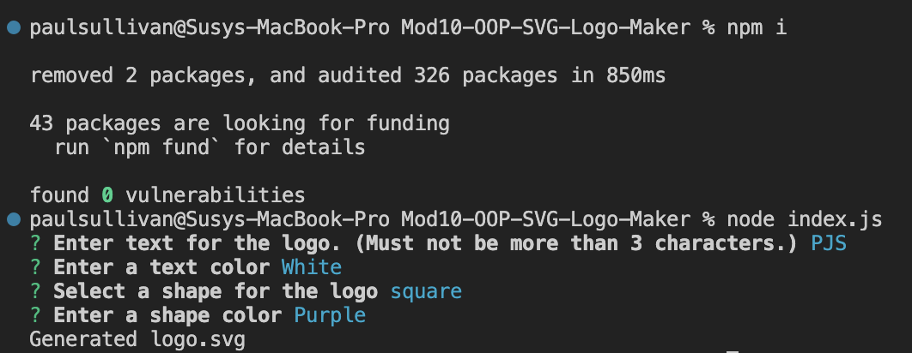
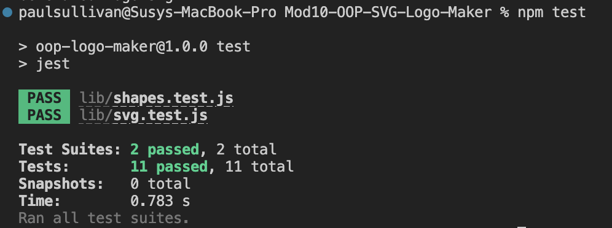

# Mod10-OOP-SVG-Logo-Maker


## Table of Contents
- [Introduction](#introduction)
- [Acceptance Criteria](#acceptance-criteria)
- [Getting Started](#getting-started)
  - [Installation](#installation)
- [Usage](#usage)
- [Contributing](#contributing)
- [License](#license)

## Introduction

AS a freelance web developer I want to generate a simple logo for my projects.

### Acceptance Criteria

    GIVEN a command-line application that accepts user input
    WHEN I am prompted for text
    THEN I can enter up to three characters
    WHEN I am prompted for the text color
    THEN I can enter a color keyword (OR a hexadecimal number)
    WHEN I am prompted for a shape
    THEN I am presented with a list of shapes to choose from: circle, triangle, and square
    WHEN I am prompted for the shape's color
    THEN I can enter a color keyword (OR a hexadecimal number)
    WHEN I have entered input for all the prompts
    THEN an SVG file is created named `logo.svg`
    AND the output text "Generated logo.svg" is printed in the command line
    WHEN I open the `logo.svg` file in a browser
    THEN I am shown a 300x200 pixel image that matches the criteria I entered

## Getting Started


### Installation


1. Install dependencies:
```
npm install
```
2. Run the application:
```
node server.js
```
3. Follow the propmts:

? Enter text for the logo. (Must not be more than 3 characters.):
? Enter a text color:
? Select a shape for the logo:
? Enter a shape color:

4. A logo.svg should be added to your to the working directory. Open that with live server.

## Usage

GITHUB link: (https://github.com/pauljsully/Mod10-OOP-SVG-Logo-Maker.git)

## Screenshots and Video Demonstration

npm i and node index.js


npm test


logo created


## License

[MIT License](https://opensource.org/licenses/MIT).
